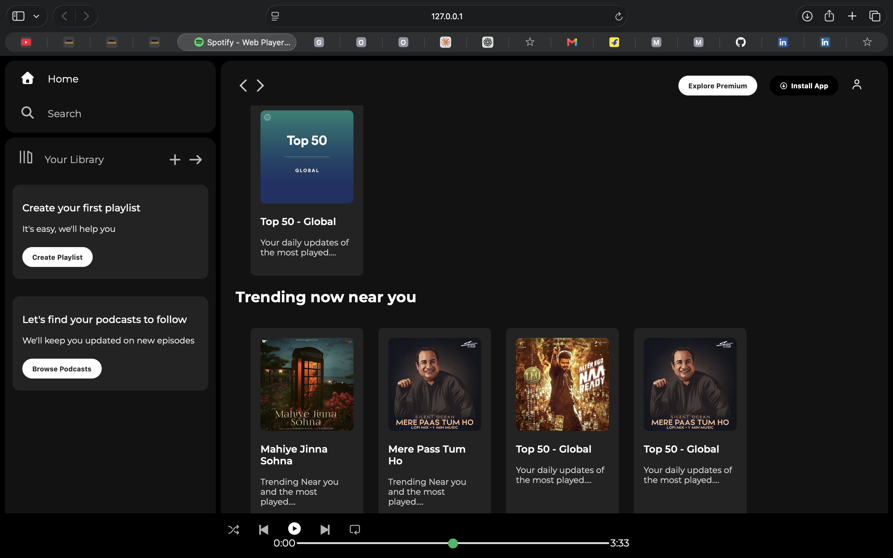

  
<div align="center">

# 🎵 Spotify Clone


# 🎧 Spotify Clone UI

### *A beautiful and responsive Spotify-inspired user interface built using only HTML & CSS.*

<p>
This project recreates the modern Spotify homepage with a clean layout, stylish design, smooth hover effects, and a responsive interface. It was built to strengthen my front-end development skills and practice creating pixel-perfect UI designs.
</p>

</div>

---

# 📸 Preview

<div align="center">



</div>

---

# ✨ Features

<table>
<tr>
<td>🎵 Spotify Inspired Design</td>
<td>Modern UI similar to Spotify</td>
</tr>

<tr>
<td>📱 Responsive Layout</td>
<td>Works across different screen sizes</td>
</tr>

<tr>
<td>🎨 Beautiful Styling</td>
<td>Custom CSS with attractive colors</td>
</tr>

<tr>
<td>⚡ Smooth Hover Effects</td>
<td>Interactive buttons and navigation</td>
</tr>

<tr>
<td>🖥️ Sidebar Navigation</td>
<td>Spotify-like sidebar menu</td>
</tr>

<tr>
<td>🎼 Music Cards</td>
<td>Playlist and album sections</td>
</tr>

<tr>
<td>💚 Footer Music Player UI</td>
<td>Spotify-style player interface</td>
</tr>

</table>

---

# 🛠️ Built With

| Technology | Usage |
|------------|-------|
| 🌐 HTML5 | Structure |
| 🎨 CSS3 | Styling & Layout |

---

# 📂 Project Structure

```text
Spotify-Clone/
│
├── index.html
├── style.css
├── Spotify.jpg
└── README.md
```

---

# 🚀 Getting Started

### Clone the Repository

```bash
git clone https://github.com/your-username/spotify-clone.git
```

### Open the Project

Simply open **index.html** in your browser.

No installation required.

---

# 🌟 Future Improvements

I plan to make this project much closer to the real Spotify experience by adding:

- 🎵 Music Playback
- 🔍 Song Search
- 👤 User Authentication
- ❤️ Like & Favorite Songs
- 📂 Playlists
- ⏯️ Fully Functional Music Player
- 🎚️ Volume Controls
- ⏭️ Next / Previous Song
- 📱 Better Mobile Responsiveness
- 🌙 Dark Mode Improvements
- ⚛️ React Version
- 🔥 Backend Integration
- ☁️ Database Support
- 🎧 Real Spotify-like Experience

---

# 💡 What I Learned

- HTML5 Structure
- CSS Flexbox
- CSS Grid
- Responsive Design
- Positioning
- UI Cloning
- Clean Folder Structure
- Modern Web Design Principles

---

# 🤝 Contributing

Contributions, ideas, and suggestions are always welcome.

Feel free to fork the repository and submit a Pull Request.

---

# ⭐ Show Your Support

If you liked this project, please consider giving it a ⭐ on GitHub.

It motivates me to build more amazing projects.

---

<div align="center">

## 🎵 Keep Coding • Keep Building • Keep Growing 🚀

Made with ❤️ by **Vikas Yadav**

</div>
````
